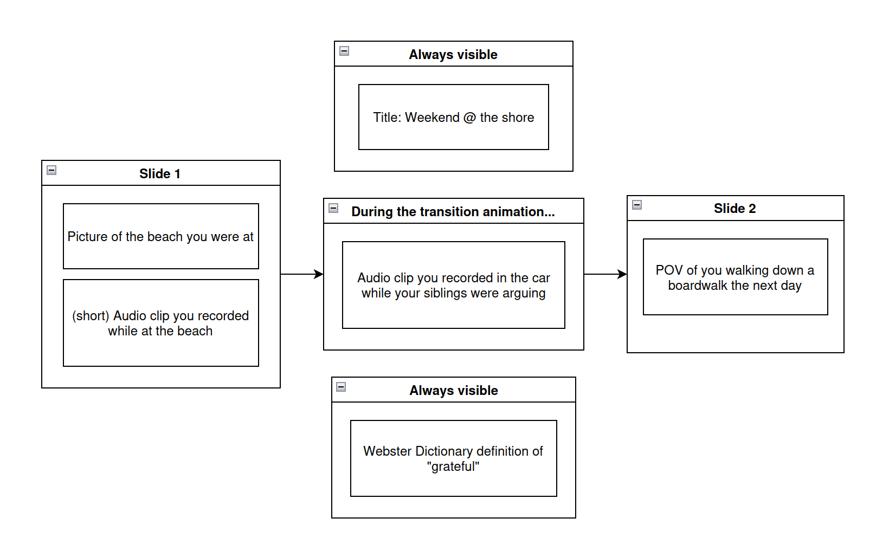

# working title: dream.viz

## "Idea"
[5a: an entity (such as a thought, concept, sensation, or image) actually or potentially present to consciousness](https://www.merriam-webster.com/dictionary/idea?utm_campaign=sd&utm_medium=serp&utm_source=jsonld)

It is a common human experience to struggle to communicate the complex processes occuring in within our own minds. This experience is often emotional: some dramatic event happens to us and we find it difficult to "put into words" how we truly, deeply feel about it. One way humans tend to overcome this obstacle is the creation of new words and language. 

The rise of social media has popularized a good number of words and phrases that can succintly very human concepts. 

One consequence of widely sharing this kind of language is that it allows us to reference, compare, and communicate ideas to each other in much clearer ways than we may come up with by ourselves.

Of course, this idea is not in any way new or original. Thoughts and emotions are communicated in a bunch of ways that don't revolve around language. Visual art, music, dance, and so on are mediums that may only partially or not at all rely on words to convey meaning. However, many feel that creating "art" is something reserved for specific people. Those who feel that their drawing skills are inadequate may not devote a lot of time to expressing themselves visually; many who feel like they are "not good" at singing tend to inhibit that deeply human act until they are alone (i.e. in the shower) or with people they feel very comfortable with. 

What this project attempts to create is a medium through which users can collect various media and arrange them spatially/temporarly to convey a single idea or concept that they may struggle to clearly communicate. 

This "viz" or visualization could then be shareable through a simple temporary bit.ly-like link. I am aware that a number of applications similar to this already exist: TikTok, Prezi, vision boards, and so on. The next step would be to allow the creation of new "viz" types be as straightforward as creating the "viz" itself. Prezi, for example, can present media in a PowerPoint-like fashion were viewers move through various slides with different content on each. TikTok allows videos to play with separate audio clips playing simulataneously. These methods of conveying information can be viewed as two separate "viz"-types. Users would be given the tools to create more of their own. I am only one person: I can only come up with so many ideas. I believe that if people were given a convenient way to come up with new ways of packaging media and visualizing the result, we would discover a whole lot of "new" ways of sharing ideas with each other. I think the rise of innumerable TikTok trends makes this clear. Giving people an easy platform to create will result in a lot of new, creative concepts.

Ideally, with the current trend of dramatic increases in computational power and software complexity, we will get closer and closer to being able to actualize our thoughts, feelings, and daydreams into tangible forms that we can share with others. Not being able to properly put a feeling "into words" may cause us to express ourselves to others in a way that only partially communicates what we really have going on inside our heads. This project hopes to help bridge that gap.

## example?

 

